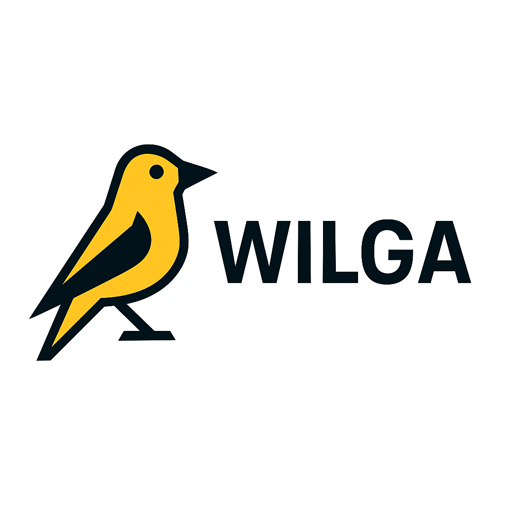

# Wilga – Gry na wysokim pułapie

⚠️ **Uwaga**

Ten projekt jest w fazie rozwoju:  
- Zawiera wiele **funkcji eksperymentalnych i nieprzetestowanych**.  
- **Nazwy procedur i sposób ich wywołania mogą się zmieniać** między wersjami.  
- Używaj świadomie i na własną odpowiedzialność.  

Celem projektu jest eksperymentowanie i szybki rozwój - stabilność API nie jest jeszcze gwarantowana.

---

## ℹ️ Informacje

⚠️ Projekt udostępniony jako open source **bez wsparcia autora**-  
Nie przyjmuję **PR, Issues ani zgłoszeń błędów**.  

💡 Kod możesz sklonować lub sforkować i rozwijać na własną rękę.

---

## 📜 Licencja

Projekt udostępniony na licencji [MIT](LICENSE).  
Możesz swobodnie korzystać, kopiować i modyfikować kod – zgodnie z zasadami tej licencji.
